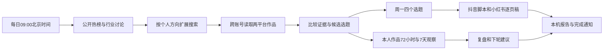

# 内容工作台 · Mac

把找资料、筛选四个选题、写两平台稿件、登记发布和复盘接成一个本地后台流程。账号方向包含 AI 实践、日常生活和个人心得。

## 下一步：只配置一次

[从 GitHub 下载完整 Mac 安装包](https://github.com/xiqianshu/title-every-week/raw/refs/heads/feat/creator-automation/releases/creator-workflow-mac.zip)。若直接下载链接没有保存文件，可打开该分支的 `releases/creator-workflow-mac.zip` 文件页，点击 **Download raw file**。

1. 解压 Mac 安装包，双击 **安装.command**。首次下载固定版本依赖，沿用已安装的 Node.js、Chrome 和 Codex 登录。若 macOS 拦截文件，按 Finder 右键「打开」及系统提示操作。
2. 在自动打开的中文工作台进入「账号与自动运行」，保持默认 **Playwright**。打开此前的 Playwright 扩展连接页面，把 `PLAYWRIGHT_MCP_EXTENSION_TOKEN=` 后面的值粘贴到工作台；也支持粘贴整行。令牌只保存到本机，不发到聊天里。
3. Chrome 保持打开，分别正常登录抖音和小红书。保存设置，点击 **研究热门与选题**。报告先展示研究范围、候选判断及证据，再列实际作品和缺失来源；页面能打开不算读取成功。
4. 采集验收通过后，点击 **生成本周选题与稿件**。确认报告可用，再勾选「开启自动运行」并保存。终端和工作台页面可以关闭，后台继续运行；双击 **打开工作台.command** 回到报告。

无需重装你已有的 Playwright 扩展，也不需要每次在终端输入采集指令。只有 Codex 登录过期时需要重新完成官方登录。

已经安装 0.2.0 或更新版本后，在「账号与自动运行」底部的 **程序更新** 点击 **检查更新**，有新版时点击 **安装更新**。后台从本仓库下载经过校验的版本，准备依赖后再切换程序；工作台短暂重启后会载入新版。已有设置、连接令牌、素材和报告保留。更新期间暂停采集和保存操作；新版无法启动时恢复原程序。没有静默自动安装。

如果 Chrome 能访问 GitHub，但旧版更新显示 `curl (28) Connection timed out`，后台和浏览器可能使用了不同的代理路径。0.3.1 的更新下载在没有显式代理环境变量时读取 macOS 已开启的 HTTP／HTTPS／SOCKS 系统代理，保留 TLS 校验；不修改系统网络设置。PAC 脚本和仅在 Chrome 扩展里配置的代理不属于此自动读取范围。旧版无法下载修复时，通过 Chrome 下载完整安装包、解压并双击新文件夹的「安装.command」恢复，已有 data 保留。这是旧版更新器的恢复方式，不能通过更换工作台地址修复。

旧版没有更新按钮，需要再下载并安装一次当前版本；双击**新解压文件夹**里的「安装.command」，安装后刷新工作台。下载目录里的旧 ZIP 和旧解压文件夹只是安装副本，可以在新安装完成后删除；保留 `~/creator-workflow/automation`，尤其不要删除其中的 `data`。如果后台服务本身无法启动，也可以使用安装包恢复。

## 后台流程



- 时间可改。首次自动任务也生成选题包，其他日期采集并更新复盘。
- 每周两篇 AI 实践、一篇日常、一篇个人心得；四个核心选题分别适配两平台，共八份稿件。
- 公开来源包括抖音热点、百度热搜、B站热门、V2EX、少数派、GitHub 趋势，每源最多三十条；部分接口可能受限，逐源报告。它们是榜单／列表／行业线索，不是整个互联网或全站作品数据库。
- 从公开资料自动选择三个相关研究方向，再到两平台搜索。无相关热榜时使用轮换探索方向，明确没有热点证据。发现页推荐、搜索前排和榜单位置分别处理，不把它们当成同一种热度。
- 默认最多十二个浏览器来源、每来源五条，优先保留两平台发现入口和三个方向的搜索位置。本人作品按到期窗口轮换，指定对标账号／作品只作补充。原十来源默认配置在升级时迁移为十二，个人偏好、令牌和报告保留。
- 一次只运行一个任务。浏览器每批最多三个来源、最多四分钟；前批完成后立即保存，后批失败不会全部丢失。研究计划、选题判断、每次写稿各最多六分钟。整轮可能需要十几分钟，进度分阶段显示，不无限重试。
- 采集页面会自动静音，可能在导航刚加载时有短暂声音。运行时可点击 **停止当前任务并暂停自动运行**；已取得资料保留，重新勾选自动运行前不会继续定时执行。
- 候选判断提供证据等级、来源链接、适合本人的角度和待验证事项。账号观察只统计真实日期的已采集样本，不冒充完整发布频率；没有连续账号快照不能判断增粉或增长。
- Mac 休眠时暂停，恢复后补做当天任务，不重放所有错过的天。关机、断网、Chrome 关闭或登录失效时不能持续采集。
- 完成后尝试显示 macOS 通知，是否弹出由系统通知设置决定；报告始终可在工作台读取。

## 真实素材与发布复盘

在「我的真实素材」记录愿意用于内容的实际行动、AI 实验和心得。未做过的事情明确标为想法。没有素材的个人稿件生成待补模板，不应作为事实直接发布；仍需要本人确认、拍摄或制作、发布。

发布后登记 **完整作品详情链接** 和北京时间，不能用账号页、搜索页或短链接。小红书详情链接保留网页的 `xsec_token` 参数。同一链接再次保存可以补充新的真实指标快照。

自动读取公开页面实际提供的指标。播放量、阅读量、新增关注等后台数据不会假装已取得；可以手动补充。未知留空，不是零。全空快照不占用有效窗口；超过应观察时间六小时的快照标为延迟，不能冒充准时 72 小时数据。每日采集不保证每个窗口恰好准点。

## 当前实际状态

这是可安装的研究流程，已通过本地程序测试、固定 MCP 协议连接及 Chromium 页面读取测试。GitHub 趋势实际返回过九条资料；新增其他公开接口在此云环境受网络白名单限制，尚未实测通过。**完整外部采集、两平台采集与模型生成仍须在使用者的 Mac 上验收**；不能以程序测试替代真实数据验收。

本地程序可以按计划主动启动。当前网页聊天没有连接你的 Mac，你在这里说「去抓一下」还不能直接触发本机任务；即时操作可以点击工作台按钮。远程聊天触发需要以后增加设备连接。

登录、验证码和平台限制仍可能需要本人处理，程序会停止该平台后续来源并记录原因。后台仅暴露导航、有限等待、当前公开页核对和固定 DOM 读取四个工具，不向模型开放任意 JavaScript、其他标签页枚举或快照。媒体静音只改变当前采集页播放状态，不操作账号。没有开启全局自动批准或关闭沙箱，不修改个人 Codex 配置。

内容生成复用本机 Codex 认证与额度；默认采集也使用模型控制浏览器，会消耗额度，无需另填 API Key。个人素材、边界和采集摘录会作为输入发送到 Codex 服务，连接令牌不放入提示词。

## 文件与停用

安装到 `~/creator-workflow/automation`；素材、报告、指标历史及设置在 `data` 文件夹，重装保留。首次默认关闭自动运行。

双击 **停用后台.command** 停止后台及正在执行的子程序，并关闭登录自启。资料保留；重跑安装入口即可启用。服务使用当前 macOS 用户的 LaunchAgent，不需要管理员权限。

报告可查看、复制、下载。保留上限：100 条素材、100 条发布记录、500 条研究作品、10000 条指标快照、50 条任务列表；历史报告文件独立保留。请自行备份 `data`。服务日志位于 `data/service.log` 和 `data/service-error.log`。

可选 OpenCLI 需要额外官方 Chrome 扩展。首版默认复用 Playwright；OpenCLI 的抖音详情读取只获取页面正文，不提供完整字幕或已核实互动指标，未知留空。两种连接均需实际平台验收。

## 开发验证

Node.js 22+。开发打包和 plist 检查需要 Python 3，用户安装不需要 Python。

```bash
npm ci --ignore-scripts --no-audit --no-fund
npm test
npm run check
npm run pack:mac
```

`npm start` 在本机启动工作台；不要让两个实例使用同一数据目录。测试替身不代表真实平台访问。依赖与 GitHub 调研见 [THIRD_PARTY.md](THIRD_PARTY.md)，实现方案在 `docs`。

发布工作台更新时，增加 `package.json` 和锁文件的版本号，完成测试后打包并复制 ZIP/SHA256 到 `releases`，先提交安装包，再运行 `node scripts/write-update-manifest.mjs` 并单独提交 `releases/latest.json`。最后推送两个提交。更新指针引用已提交的固定版本和 SHA256，不依赖可变分支下载，也避免循环引用提交号。
