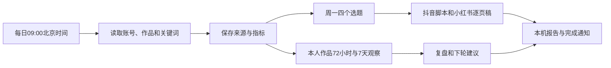

# 内容工作台 · Mac 首版

把找资料、筛选四个选题、写两平台稿件、登记发布和复盘接成一个本地后台流程。账号方向包含 AI 实践、日常生活和个人心得。

## 下一步：只配置一次

1. 解压 Mac 安装包，双击 **安装.command**。首次下载固定版本依赖，沿用已安装的 Node.js、Chrome 和 Codex 登录。若 macOS 拦截文件，按 Finder 右键「打开」及系统提示操作。
2. 在自动打开的中文工作台进入「账号与自动运行」，保持默认 **Playwright**。打开此前的 Playwright 扩展连接页面，把 `PLAYWRIGHT_MCP_EXTENSION_TOKEN=` 后面的值粘贴到工作台；也支持粘贴整行。令牌只保存到本机，不发到聊天里。
3. Chrome 保持打开，分别正常登录抖音和小红书。保存设置，点击 **只收集资料**。报告应分别列出两个平台的实际作品标题、链接、读取时间和来源状态；页面能打开不算读取成功。
4. 采集验收通过后，点击 **生成本周选题与稿件**。确认报告可用，再勾选「开启自动运行」并保存。终端和工作台页面可以关闭，后台继续运行；双击 **打开工作台.command** 回到报告。

无需重装你已有的 Playwright 扩展，也不需要每次在终端输入采集指令。只有 Codex 登录过期时需要重新完成官方登录。

## 后台流程



- 时间可改。首次自动任务也生成选题包，其他日期采集并更新复盘。
- 每周两篇 AI 实践、一篇日常、一篇个人心得；四个核心选题分别适配两平台，共八份稿件。
- 每次最多十个来源、每来源五条。本人作品按到期窗口和最近尝试轮换，并保留研究来源位置。写稿使用有限摘录，完整采集结果保存在报告。
- 一次只运行一个任务。采集最多八分钟，一次写稿最多六分钟，超时停止；失败当天不无限重试，可处理原因后在工作台重试。
- Mac 休眠时暂停，恢复后补做当天任务，不重放所有错过的天。关机、断网、Chrome 关闭或登录失效时不能持续采集。
- 完成后尝试显示 macOS 通知，是否弹出由系统通知设置决定；报告始终可在工作台读取。

## 真实素材与发布复盘

在「我的真实素材」记录愿意用于内容的实际行动、AI 实验和心得。未做过的事情明确标为想法。没有素材的个人稿件生成待补模板，不应作为事实直接发布；仍需要本人确认、拍摄或制作、发布。

发布后登记 **完整作品详情链接** 和北京时间，不能用账号页、搜索页或短链接。小红书详情链接保留网页的 `xsec_token` 参数。同一链接再次保存可以补充新的真实指标快照。

自动读取公开页面实际提供的指标。播放量、阅读量、新增关注等后台数据不会假装已取得；可以手动补充。未知留空，不是零。全空快照不占用有效窗口；超过应观察时间六小时的快照标为延迟，不能冒充准时 72 小时数据。每日采集不保证每个窗口恰好准点。

## 当前实际状态

这是可安装、通过本地程序测试的首版，**尚未在你的 Mac 部署，也未完成两平台采集与模型端到端验收**。当前云端小红书访问受限、抖音存在验证，不能以打开网页替代验收。

本地程序可以按计划主动启动。当前网页聊天没有连接你的 Mac，你在这里说「去抓一下」还不能直接触发本机任务；即时操作可以点击工作台按钮。远程聊天触发需要以后增加设备连接。

登录、验证码和平台限制仍可能需要本人处理，程序会停止该平台后续来源并记录原因。后台使用固定只读工具范围；没有开启全局自动批准或关闭沙箱，不修改原有个人 Codex 配置。

内容生成复用本机 Codex 认证与额度；默认采集也使用模型控制浏览器，会消耗额度，无需另填 API Key。个人素材、边界和采集摘录会作为输入发送到 Codex 服务，连接令牌不放入提示词。

## 文件与停用

安装到 `~/creator-workflow/automation`；素材、报告、指标历史及设置在 `data` 文件夹，重装保留。首次默认关闭自动运行。

双击 **停用后台.command** 停止后台及正在执行的子程序，并关闭登录自启。资料保留；重跑安装入口即可启用。服务使用当前 macOS 用户的 LaunchAgent，不需要管理员权限。

报告可查看、复制、下载。保留上限：100 条素材、100 条发布记录、500 条研究作品、10000 条指标快照、50 条任务列表；历史报告文件独立保留。请自行备份 `data`。服务日志位于 `data/service.log` 和 `data/service-error.log`。

可选 OpenCLI 需要额外官方 Chrome 扩展。首版默认复用 Playwright；OpenCLI 的抖音详情读取只获取页面正文，不提供完整字幕或已核实互动指标，未知留空。两种连接均需实际平台验收。

## 开发验证

Node.js 22+。开发打包和 plist 检查需要 Python 3，用户安装不需要 Python。

```bash
npm ci --ignore-scripts --no-audit --no-fund
npm test
npm run check
npm run pack:mac
```

`npm start` 在本机启动工作台；不要让两个实例使用同一数据目录。测试替身不代表真实平台访问。依赖与 GitHub 调研见 [THIRD_PARTY.md](THIRD_PARTY.md)，实现方案在 `docs`。
